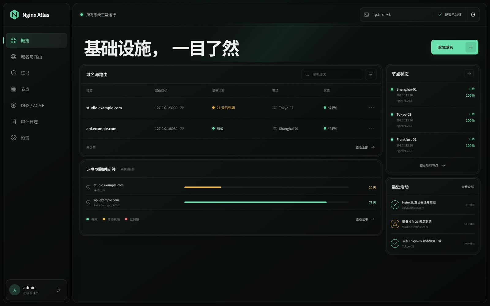
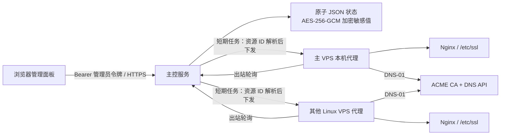

# Nginx Atlas

Nginx Atlas 是一个面向 Linux VPS 集群的 Nginx、域名路由与 TLS 证书管理面板。主控运行在一台 VPS 上，其余节点通过一次性命令加入；节点只主动连接主控，不需要暴露额外的入站管理端口。



> 当前仓库包含可运行的主控、节点代理、React 管理界面和安装器。首次公开发布前，请用本地二进制安装方式；发布 Release 后，安装器会自动下载并校验对应架构的包。

## 能做什么

- 将新域名路由到指定节点的 `上游地址:项目端口`。
- 自动生成隔离的 Nginx 站点配置，先执行 `nginx -t`，成功后才重载；失败自动恢复原文件。
- 识别 `/etc/ssl/<域名>/fullchain.pem` 与 `/etc/ssl/<域名>/privkey.pem`。
- 校验证书 PEM、有效期、域名 SAN、证书与私钥是否匹配。
- 上传现有证书，或通过 lego + DNS-01 向 Let’s Encrypt/兼容 ACME 服务申请证书。
- 为上传或本机已有证书绑定 DNS/ACME 账户，在到期窗口内自动切换到 ACME 续期。
- 将证书版本推送到多台 VPS；每台节点分别原子写入、验证并重载 Nginx。
- 一次性添加令牌、节点撤销、自动重试、离线任务排队和审计日志。
- 响应式中文管理界面，支持桌面与移动端。

## 架构



主控以非特权 `nginx-atlas` 用户运行。节点代理需要 root 权限写入 `/etc/nginx`、`/etc/ssl` 并调用 `systemctl reload nginx`，因此 systemd 单元启用了可用的额外隔离项，但不会假装把必要权限完全移除。

## 快速开始

### 一键安装主控

面板域名的证书已经位于 `/etc/ssl/<面板域名>/fullchain.pem` 与 `privkey.pem` 时，可直接执行：

```bash
curl -fsSL https://raw.githubusercontent.com/yayitinyu/nginx-atlas/main/deploy/install.sh \
  | sudo bash -s -- server \
      --public-url https://atlas.example.com \
      --panel-domain atlas.example.com
```

安装器会从最新 GitHub Release 下载当前 CPU 架构的程序并校验 SHA-256。重复执行同一条命令可更新程序；已有主密钥、管理员令牌、节点身份和状态文件会被保留。

若面板证书尚不存在，主控和本机 Agent 仍会启动，但不会创建公网 Nginx 站点。此时可使用已有反向代理，或先通过 DNS-01 签发证书再重新运行安装命令。

一键检查服务：

```bash
sudo bash -c 'nginx -t && systemctl is-active nginx nginx-atlas-server nginx-atlas-agent'
```

添加其他 VPS 时不应复用固定令牌。请在面板“节点 → 添加节点”中生成一次性命令；它会自动采用正确的主控地址、短期令牌和节点名称。

### 1. 本地构建

Linux/macOS：

```bash
VERSION=0.1.0 ./scripts/build.sh
```

Windows PowerShell：

```powershell
.\scripts\build.ps1 -Version 0.1.0
```

要求：Go 1.24+、Node.js 22.12+、npm。

### 2. 准备面板 HTTPS 证书

假设面板域名为 `atlas.example.com`：

```text
/etc/ssl/atlas.example.com/fullchain.pem
/etc/ssl/atlas.example.com/privkey.pem
```

安装器检测到这两个文件后，会自动创建 HTTPS 反向代理。若证书由外部负载均衡器或已有反向代理终止，可由它将请求转发到 `127.0.0.1:9090`；节点对远程主控只接受 HTTPS。

### 3. 安装主控与本机代理

在源码目录中运行：

```bash
sudo bash deploy/install.sh server \
  --public-url https://atlas.example.com \
  --panel-domain atlas.example.com \
  --binary-file ./bin/nginx-atlas
```

安装器会：

1. 检测 `apt` / `dnf` / `yum`，缺少 Nginx 时安装并设置自启。
2. 安装并校验 Nginx Atlas 与 lego。
3. 生成主密钥和管理员令牌；重复安装时保留已有值。
4. 启动非特权主控服务与本机节点代理。
5. 扫描符合约定的证书目录，并运行 `nginx -t`。
6. 若面板证书存在，创建 HTTPS 站点并重载 Nginx。

终端只在首次安装时打印管理员令牌。请立即保存；主控只用它的哈希比较请求，面板将令牌保存在 `sessionStorage`，关闭浏览器会话后需重新输入。

### 4. 添加其他 VPS

进入“节点”页面，点击“添加节点”，复制生成的命令，在目标 VPS 上执行即可。命令形如：

```bash
curl -fsSL https://atlas.example.com/install.sh | sudo bash -s -- agent \
  --server https://atlas.example.com \
  --token '<一次性令牌>' \
  --name 'Tokyo-02'
```

令牌默认 30 分钟过期且只能使用一次。注册完成后，节点保存独立随机密钥；主控只持久化其 SHA-256 哈希。

## 添加域名

“添加域名”流程包含：

1. 域名、目标节点、上游地址和项目端口。
2. 证书来源：
   - **已有证书**：使用目标节点 `/etc/ssl/<域名>`，主控可捕获并加密保存以便同步；
   - **上传证书**：上传 `fullchain.pem` 与 `privkey.pem`；
   - **Let’s Encrypt**：选择 DNS 与 ACME 账户，通过 DNS-01 签发；
   - 可明确选择仅 HTTP。
3. 可选的同步目标节点与自动续期。
4. Nginx 配置预览与“验证并部署”。

典型 TLS 配置会生成 HTTP 到 HTTPS 的 308 跳转、TLS 站点、反向代理头与 WebSocket 升级头。文件写入后才运行 `nginx -t`；配置校验或 reload 失败会恢复之前的配置和证书。

## DNS 与 ACME 账户

DNS 提供商名称及环境变量采用 [lego 官方 DNS provider 文档](https://go-acme.github.io/lego/dns/) 的定义。例如 Cloudflare 推荐使用：

```text
Provider: cloudflare
Credential: CLOUDFLARE_DNS_API_TOKEN=<最小权限 API Token>
```

禁止 `manual` 和 `exec` 提供商进入无人值守任务，避免交互阻塞或任意程序执行。DNS 环境变量名必须是大写字母、数字与下划线，凭据不会出现在 API 列表、审计日志或任务持久化数据中。

ACME 账户默认目录：

```text
https://acme-v02.api.letsencrypt.org/directory
```

也支持自定义 HTTPS ACME 目录与可选 EAB KID/HMAC。代理使用当前 lego v5 命令格式：`lego run --dns ... --renew-days 30`；证书仍会在主控侧重新验证后才被保存和同步。参见 [lego 官方签发/续期文档](https://go-acme.github.io/lego/usage/cli/renew-a-certificate/)。

## 证书同步与续期

- 证书和私钥在主控状态文件中使用 AES-256-GCM 加密，并绑定独立用途标签。
- 队列中仅保存证书、域名和账户 ID；代理领取任务时才短暂解密并通过 HTTPS 下发。
- 节点将新文件写入同目录临时文件，设置 `fullchain.pem` 为 `0644`、`privkey.pem` 为 `0600`，再原子替换。
- 每个节点独立执行证书校验、`nginx -t` 和 reload；失败会恢复它自己的旧版本。
- 调度器每 15 秒处理离线与超时任务，并在证书进入 `renew_before_days` 窗口时创建 ACME 续期任务。

## 运行路径

| 用途 | 路径 |
| --- | --- |
| 主控配置 | `/etc/nginx-atlas/server.env` |
| 节点配置 | `/etc/nginx-atlas/agent.env` |
| 主控状态 | `/var/lib/nginx-atlas/server/state.json` |
| 节点凭据 | `/var/lib/nginx-atlas/agent/state.json` |
| ACME/lego 数据 | `/var/lib/nginx-atlas/agent/lego/` |
| 托管 Nginx 站点 | `/etc/nginx/conf.d/atlas-<域名>.conf` |
| 域名证书 | `/etc/ssl/<域名>/fullchain.pem`、`privkey.pem` |

常用命令：

```bash
systemctl status nginx-atlas-server nginx-atlas-agent nginx
journalctl -u nginx-atlas-server -f
journalctl -u nginx-atlas-agent -f
nginx -t
```

## 发布安装包

安装器默认从 `yayitinyu/nginx-atlas` 的最新 GitHub Release 下载，并要求以下资产命名：

```text
nginx-atlas_<version>_linux_amd64.tar.gz
nginx-atlas_<version>_linux_arm64.tar.gz
checksums.txt
```

生成资产：

```bash
VERSION=0.1.0 ./scripts/build-release.sh
```

推送形如 `v0.1.0` 的 Git Tag 后，仓库的 Release 工作流也会自动构建、校验并发布 amd64/arm64 安装包。

也可用 `--repo owner/repo` 指定其他仓库，或用 `--binary-url` 与强制的 `--binary-sha256` 安装自定义包。

## 开发与验证

```bash
go test ./...
go vet ./...
cd web && npm ci && npm run build
bash -n deploy/install.sh
```

本地演示：

```bash
./bin/nginx-atlas generate-secrets
# 将输出设置到环境变量后：
ATLAS_DEMO=true ATLAS_STATE_PATH=.data/demo-state.json ./bin/nginx-atlas server
```

Windows 上可以验证 Go 逻辑、前端构建、API、加密、证书解析、Nginx 模板和回滚单元测试；它不能证明 Linux 上的 systemd、发行版包管理、防火墙、真实 Nginx reload 或 DNS 提供商签发。正式部署前请先在测试 VPS 完成端到端验证。

## 安全注意事项

- 主控公网入口必须使用可信 HTTPS；不要在明文 HTTP 中发送管理员令牌、节点密钥或证书私钥。
- 对 DNS API Token 使用最小权限并限制可管理 Zone。
- 备份 `/etc/nginx-atlas` 与 `/var/lib/nginx-atlas/server`；两者缺一都无法恢复加密数据。
- 不要手工编辑 `atlas-<域名>.conf`，代理下次部署会替换它。
- 删除域名只删除托管 Nginx 配置，不自动删除 `/etc/ssl/<域名>`，避免误删仍被其他服务使用的证书。

## 许可证

Nginx Atlas 使用 [MIT License](LICENSE)。
