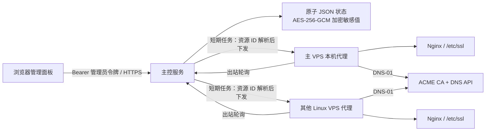

# Nginx Atlas

Nginx Atlas 是一个面向 Linux VPS 集群的 Nginx、域名路由与 TLS 证书管理面板。主控运行在一台 VPS 上，其余节点通过一次性命令加入；节点只主动连接主控，不需要暴露额外的入站管理端口。


> 当前仓库包含可运行的主控、节点代理、React 管理界面和安装器。生产部署可直接使用最新 Release 的一键安装命令；安装器会自动下载并校验对应架构的包。

## 能做什么

- 将新域名路由到指定节点的 `上游地址:项目端口`。
- 自动生成隔离的 Nginx 站点配置，先执行 `nginx -t`，成功后才重载；失败自动恢复原文件。
- 识别 `/etc/ssl/<域名>/fullchain.pem` 与 `/etc/ssl/<域名>/privkey.pem`。
- 校验证书 PEM、有效期、域名 SAN、证书与私钥是否匹配。
- 上传现有证书，或通过 lego + DNS-01 向 Let’s Encrypt/兼容 ACME 服务申请证书。
- 为上传或本机已有证书绑定 DNS/ACME 账户，在到期窗口内自动切换到 ACME 续期。
- 在证书页随时开启或关闭自动续期；手动续期必须经过确认，避免误触发签发任务。
- 将单张证书下载为包含 `fullchain.pem` 与 `privkey.pem` 的 ZIP；下载前需再次验证当前管理员密码，并写入审计日志。
- 将证书版本推送到多台 VPS；每台节点分别原子写入、验证并重载 Nginx。
- 单张 ACME 证书可包含最多 20 个 SAN/通配符域名，并在后续续期中保持完整名称集合。
- 可在添加域名时创建或更新 Cloudflare A/AAAA/CNAME 记录，并选择橙云代理或灰云 DNS。
- 从各节点的 `nginx -T` 输出中提取安全元数据；可只监控现有规则，也可备份后安全接管。
- 在面板检查 GitHub 发行版并更新主控/子节点代理；APT 节点可确认后更新软件包与 Nginx。
- 可修改节点显示名称，并复制只卸载 Atlas Agent、保留 Nginx 配置与证书的命令。
- 一次性添加令牌、节点撤销、自动重试、离线任务排队和审计日志。
- 支持管理员密码轮换、系统/浅色/深色主题，以及自动识别系统语言的中英文界面。
- 可启用安全入口路径；只有先访问正确路径的浏览器会跳转到登录页，其余请求返回选定的通用 Nginx 错误页。
- 响应式管理界面完整适配桌面与移动端竖屏。

## 架构



主控以非特权 `nginx-atlas` 用户运行。节点代理需要 root 权限写入 `/etc/nginx`、`/etc/ssl` 并调用 `systemctl reload nginx`，因此 systemd 单元启用了可用的额外隔离项，但不会假装把必要权限完全移除。

## 快速开始

### 从 GitHub 一键部署主节点

面板域名的证书建议先放到：

```text
/etc/ssl/<面板域名>/fullchain.pem
/etc/ssl/<面板域名>/privkey.pem
```

然后在主控 VPS 上执行（将 URL/域名换成你的）：

```bash
curl -fsSL https://github.com/yayitinyu/nginx-atlas/releases/latest/download/install.sh \
  | sudo bash -s -- server \
      --public-url https://atlas.example.com \
      --panel-domain atlas.example.com
```

安装器会：

1. 从最新 GitHub Release 下载当前 CPU 架构（amd64/arm64）安装包并校验 SHA-256；
2. 安装/更新 `nginx-atlas` 二进制与 lego；
3. 启动主控服务与本机节点代理；
4. 若面板证书存在，创建 HTTPS 反向代理站点。

**重复执行同一条命令即可原地升级**；已有主密钥、管理员令牌、节点身份和状态文件会被保留。

若面板证书尚不存在，主控和本机 Agent 仍会启动，但不会创建公网 Nginx 站点。此时可使用已有反向代理，或先通过 DNS-01 签发证书再重新运行安装命令。

一键检查服务：

```bash
sudo bash -c 'nginx -t && systemctl is-active nginx nginx-atlas-server nginx-atlas-agent && nginx-atlas version'
```

### 一键卸载主节点

仅移除主控、本机 Agent、systemd 单元与共享二进制；**保留**配置/状态（便于重装恢复），且**不会**删除 Nginx 软件包、托管站点 `atlas-*.conf` 或 `/etc/ssl` 证书：

```bash
curl -fsSL https://github.com/yayitinyu/nginx-atlas/releases/latest/download/install.sh \
  | sudo bash -s -- uninstall-server
```

若需连同配置、状态与主密钥一并清除（不可恢复）：

```bash
curl -fsSL https://github.com/yayitinyu/nginx-atlas/releases/latest/download/install.sh \
  | sudo bash -s -- uninstall-server --purge-state
```

仅卸载普通节点上的 Agent（保留 Nginx 与证书）时使用：

```bash
curl -fsSL https://github.com/yayitinyu/nginx-atlas/releases/latest/download/install.sh \
  | sudo bash -s -- uninstall-agent
```

添加其他 VPS 时不应复用固定令牌。请在面板“概览 → 安装与卸载 → 安装节点”中获取一次性命令；它会自动采用正确的主控地址和短期令牌，节点首次注册时使用主机名，之后可在节点管理中改名。

### 1. 本地构建

Linux/macOS：

```bash
VERSION=0.1.0 ./scripts/build.sh
```

Windows PowerShell：

```powershell
.\scripts\build.ps1 -Version 0.1.0
```

要求：Go 1.24+、Node.js 22.12+、npm。

### 2. 准备面板 HTTPS 证书

假设面板域名为 `atlas.example.com`：

```text
/etc/ssl/atlas.example.com/fullchain.pem
/etc/ssl/atlas.example.com/privkey.pem
```

安装器检测到这两个文件后，会自动创建 HTTPS 反向代理。若证书由外部负载均衡器或已有反向代理终止，可由它将请求转发到受保护的本机端口 `127.0.0.1:909`；节点对远程主控只接受 HTTPS。手工创建 systemd 服务时，主控进程需要仅授予绑定该端口所需的 `CAP_NET_BIND_SERVICE`。

同机 Nginx 的代理 `location` 还必须覆盖 `X-Real-IP`，并写入 `include /etc/nginx-atlas/proxy-token.conf;`。其他代理需安全读取 `server.env` 中的 `ATLAS_PROXY_TOKEN`，覆盖 `X-Atlas-Proxy`；启用该令牌后，缺少有效代理凭据的环回管理请求会被主控拒绝，避免访问白名单与登录限流误把所有访客当作本机。

### 3. 安装主控与本机代理

在源码目录中运行：

```bash
sudo bash deploy/install.sh server \
  --public-url https://atlas.example.com \
  --panel-domain atlas.example.com \
  --binary-file ./bin/nginx-atlas
```

安装器会：

1. 检测 `apt` / `dnf` / `yum`，缺少 Nginx 时安装并设置自启。
2. 安装并校验 Nginx Atlas 与 lego。
3. 生成主密钥和管理员令牌；重复安装时保留已有值。
4. 启动非特权主控服务与本机节点代理。
5. 扫描符合约定的证书目录，并运行 `nginx -t`。
6. 若面板证书存在，创建 HTTPS 站点并重载 Nginx。

终端只在首次安装时打印管理员令牌。请立即保存；主控只用它的哈希比较请求，面板将令牌保存在 `sessionStorage`，关闭浏览器会话后需重新输入。

### 4. 添加其他 VPS

进入“概览”页面，展开“安装节点”，复制命令并在目标 VPS 上执行。命令形如：

```bash
( tmp=$(mktemp) && trap 'rm -f -- "$tmp"' EXIT && chmod 600 "$tmp" && \
  curl -fsSL https://atlas.example.com/install.sh -o "$tmp" && \
  printf '%s' '<一次性令牌>' | sudo bash "$tmp" agent --server https://atlas.example.com --token-stdin )
```

令牌默认 30 分钟过期且只能使用一次。注册完成后，节点保存独立随机密钥；主控只持久化其 SHA-256 哈希。卸载节点与卸载主控的命令也集中在同一区域。

## 添加域名

“添加域名”流程包含：

1. 域名、目标节点、上游地址和项目端口。
2. 证书来源：
   - **已有证书**：选择证书页已管理且覆盖该域名的证书；
   - **Let’s Encrypt**：自动选中已有 DNS 与 ACME 账户，通过 DNS-01 签发，并可开启自动续期。
3. 可选同步 Cloudflare DNS：自动使用节点 IP 或填写 A/AAAA/CNAME 目标，并选择橙云或灰云。
4. Nginx 配置预览与“验证并部署”。证书上传、节点证书接管、跨节点分发和自动化账户统一在“证书”页管理。

典型 TLS 配置会生成 HTTP 到 HTTPS 的 308 跳转、TLS 站点、反向代理头与 WebSocket 升级头。文件写入后才运行 `nginx -t`；配置校验或 reload 失败会恢复之前的配置和证书。

## DNS 与 ACME 账户

设置页只维护一个 Cloudflare DNS 账户和一个 ACME 账户：分别填写最小权限 Cloudflare API Token 与 ACME 邮箱。申请证书时会自动使用这两个账户，不再重复选择。

Cloudflare 凭据采用 [lego 官方 DNS provider 文档](https://go-acme.github.io/lego/dns/) 的变量：

```text
Provider: cloudflare
Credential: CLOUDFLARE_DNS_API_TOKEN=<最小权限 API Token>
```

凭据不会出现在 API 列表、日志或任务持久化数据中。

启用域名的 Cloudflare 同步时，主控使用已配置的加密 API Token 查找最长匹配的活动 Zone，再创建或更新同名记录。建议 Token 只授予所需 Zone 的 DNS 编辑与 Zone 读取权限。

ACME 账户默认目录：

```text
https://acme-v02.api.letsencrypt.org/directory
```

代理使用当前 lego v5 命令格式：`lego run --dns ... --renew-days 30`；证书仍会在主控侧重新验证后才被保存和同步。参见 [lego 官方签发/续期文档](https://go-acme.github.io/lego/usage/cli/renew-a-certificate/)。

## 证书同步与续期

- 证书和私钥在主控状态文件中使用 AES-256-GCM 加密，并绑定独立用途标签。
- 上传证书时不要求特定文件名或手工填写域名；主控从证书 SAN/CN 识别域名，节点部署时统一写为 `fullchain.pem` 与 `privkey.pem`。
- 队列中仅保存证书、域名和账户 ID；代理领取任务时才短暂解密并通过 HTTPS 下发。
- 节点将新文件写入同目录临时文件，设置 `fullchain.pem` 为 `0644`、`privkey.pem` 为 `0600`，再原子替换。
- 每个节点独立执行证书校验、`nginx -t` 和 reload；失败会恢复它自己的旧版本。
- 调度器每 15 秒处理离线与超时任务，并在证书进入 `renew_before_days` 窗口时创建 ACME 续期任务。
- 关闭证书自动续期会同时停止关联域名的后续调度，但不会取消已经进入运行状态的任务。
- 证书页可编辑签发节点、续期窗口与 SAN 名称；例如一张证书同时覆盖 `nanami.im` 与 `*.nanami.im`。DNS/ACME 账户自动使用设置页中的唯一配置。
- 证书下载包不会缓存，内部文件名固定且私钥权限标记为 `0600`。下载包包含明文私钥，只应保存到受信任设备并及时移入受权限保护的位置。

## 节点维护与规则接管

- “节点 → 管理节点”可改名、检查最新 GitHub Release、更新 Atlas Agent，并在 APT 节点上确认执行软件包与 Nginx 更新；标记为“主控 VPS”的本机节点会更新主控与 Agent 共用的二进制并依次重启两项服务。
- 节点安装、节点卸载与主控卸载命令集中在概览页；节点页只保留状态与维护操作。
- 设置页可将节点状态获取频率设为 10–300 秒；主控会相应调整离线判定窗口。
- Atlas 更新包必须来自受信任的 GitHub HTTPS 地址，并同时通过 Release `checksums.txt` 的 SHA-256 与更新后二进制版本校验；当前二进制会先备份。
- 系统更新固定执行 `apt-get update`、保留现有配置的 `upgrade` 与 `nginx --only-upgrade`，前后都运行 `nginx -t`，最后才 reload。
- 卸载命令仅移除节点 Agent、凭据与服务；不会删除 Nginx、`/etc/nginx` 或 `/etc/ssl`。主控所在节点会保留共享二进制与主控数据。
- “域名 → 节点发现”默认可只监控。选择接管时，仅接受 `/etc/nginx/conf.d/` 或 `/etc/nginx/sites-enabled/` 下、可识别上游的规则；Atlas 先把原文件或符号链接移入私有备份，再写入托管配置。验证或 reload 失败会恢复原规则，删除接管域名时也会恢复它。

## 运行路径

| 用途 | 路径 |
| --- | --- |
| 主控配置 | `/etc/nginx-atlas/server.env` |
| 节点配置 | `/etc/nginx-atlas/agent.env` |
| 主控状态 | `/var/lib/nginx-atlas/server/state.json` |
| 节点凭据 | `/var/lib/nginx-atlas/agent/state.json` |
| ACME/lego 数据 | `/var/lib/nginx-atlas/agent/lego/` |
| 托管 Nginx 站点 | `/etc/nginx/conf.d/atlas-<域名>.conf` |
| 域名证书 | `/etc/ssl/<域名>/fullchain.pem`、`privkey.pem` |

常用命令：

```bash
systemctl status nginx-atlas-server nginx-atlas-agent nginx
journalctl -u nginx-atlas-server -f
journalctl -u nginx-atlas-agent -f
nginx -t
```

## 发布安装包

安装器默认从 `yayitinyu/nginx-atlas` 的最新 GitHub Release 下载，并要求以下资产命名：

```text
nginx-atlas_<version>_linux_amd64.tar.gz
nginx-atlas_<version>_linux_arm64.tar.gz
checksums.txt
```

生成资产：

```bash
VERSION=0.1.0 ./scripts/build-release.sh
```

推送形如 `v0.1.0` 的 Git Tag 后，仓库的 Release 工作流也会自动构建、校验并发布 amd64/arm64 安装包。

也可用 `--repo owner/repo` 指定其他仓库，或用 `--binary-url` 与强制的 `--binary-sha256` 安装自定义包。

## 开发与验证

```bash
go test ./...
go vet ./...
cd web && npm ci && npm run build
bash -n deploy/install.sh
```

本地演示：

```bash
./bin/nginx-atlas generate-secrets
# 将输出设置到环境变量后：
ATLAS_DEMO=true ATLAS_STATE_PATH=.data/demo-state.json ./bin/nginx-atlas server
```

Windows 上可以验证 Go 逻辑、前端构建、API、加密、证书解析、Nginx 模板和回滚单元测试；它不能证明 Linux 上的 systemd、发行版包管理、防火墙、真实 Nginx reload 或 DNS 提供商签发。正式部署前请先在测试 VPS 完成端到端验证。

## 安全注意事项

- 主控公网入口必须使用可信 HTTPS；不要在明文 HTTP 中发送管理员令牌、节点密钥或证书私钥。
- 设置页的“访问保护”可启用安全入口、选择未认证响应状态，并与 Turnstile、IP 白名单叠加使用。入口路径只保存带服务端密钥的摘要且不会由 API 回传；保存前应妥善记录，修改路径会立即使旧浏览器入口凭据失效。
- 启用安全入口后，访问 `/<安全入口>` 会设置 HttpOnly、SameSite Strict 的签名会话 Cookie，并以 `303` 跳转到 `/login`；其他面板路径不会暴露产品名或入口信息。HTTPS 环境中的 Cookie 会同时设置 Secure。
- 对 DNS API Token 使用最小权限并限制可管理 Zone。
- 备份 `/etc/nginx-atlas` 与 `/var/lib/nginx-atlas/server`；两者缺一都无法恢复加密数据。
- 不要手工编辑 `atlas-<域名>.conf`，代理下次部署会替换它。
- 删除域名只删除托管 Nginx 配置，不自动删除 `/etc/ssl/<域名>`，避免误删仍被其他服务使用的证书。

## 许可证

Nginx Atlas 使用 [MIT License](LICENSE)。
